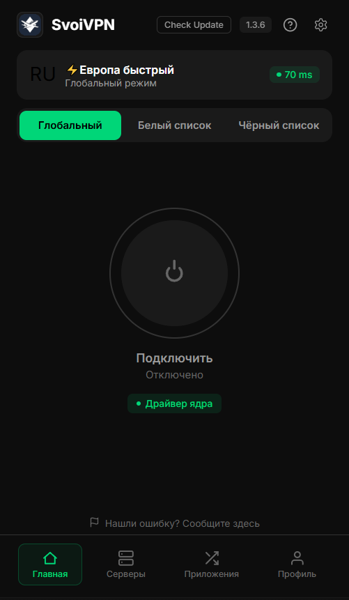

<h1 align="center">SvoiVPN</h1>

Бесплатный VPN-клиент для Windows 10/11 с <b>per-app routing</b> — сам выбираешь, какие приложения идут через VPN, а какие напрямую. 
Игры без лагов, Discord/Telegram через VPN, остальное без замедления.

  

  <a href="https://github.com/alexander174116/SvoiVPN-releases/releases/latest/download/SvoiVPN-Setup.exe"><b>⬇&nbsp; Скачать SvoiVPN для Windows</b></a>

  
  

Запусти установщик от имени администратора. Уже установлен? Клиент обновляется сам — кнопка «Check Update» в шапке.

---

## Возможности

- **Per-app routing** — whitelist/blacklist приложений (через VPN идут только нужные)
- **VLESS+Reality** и **Hysteria2**, подписка по ссылке
- **Без замедления** остального трафика (kernel-драйвер, 0&nbsp;ms overhead)
- DNS через VPN (обход блокировок), авто-реконнект, system tray

## Драйвер ядра (опционально)

При установке добавляется небольшой драйвер (WFP). Он делает per-app маршрутизацию **на уровне ядра**: приложения, которые идут мимо VPN, работают **напрямую с 0&nbsp;ms overhead** — игры и остальной трафик не замедляются вообще. Без драйвера клиент тоже работает (маршрутизация по PID), но добавляет ~1–2&nbsp;ms на не-VPN трафик. Можно не использовать — статус виден в шапке («Драйвер ядра»).

## Поддержка

- Новости и помощь: **[t.me/svoivpnnews](https://t.me/svoivpnnews)**
- Нашли баг? В приложении: **Settings → «Report a Bug»** — логи уедут разработчику.
